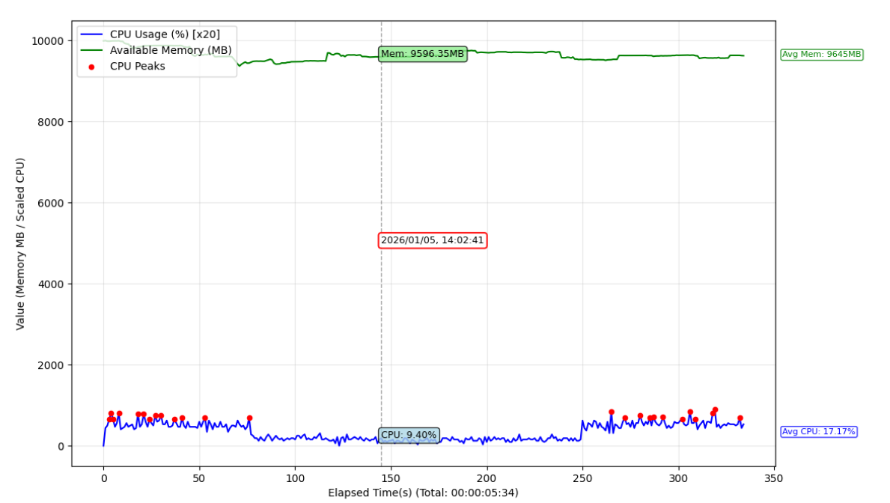

# jastm

Just Another Soak Testing Monitor — real-time system monitoring and post-run analysis for soak/stability testing.

## Overview

- **Data Collection Mode**: Samples CPU and memory at a configurable interval, optionally scoped to a process (by name, PID, or launched program). Writes a CSV log and supports an optional in-process GUI for live charts.
- **Analysis Mode**: Loads a collected CSV, computes statistics and peak detection, and optionally shows a summary report and/or an interactive metrics chart.

## Project structure

- `jastm.py`: Main CLI entrypoint and implementation of data collection and analysis.
- `README.md`: Usage guide and high-level documentation.
- `tests/`: Manual and future automated tests (for example, `smoke_test.md`).

## Requirements

- **Python**: 3.x
- **Dependencies**: `psutil`, `matplotlib` (with TkAgg backend), `tkinter` (usually bundled with Python), `PyYAML` (for config file support)

Install:

```bash
pip install psutil matplotlib pyyaml
```

## Usage

### Data collection (soak run)

- **System-wide** (no process filter):  
  `python jastm.py`
- **By process name**:  
  `python jastm.py --process-name "python.exe"`
- **By PID**:  
  `python jastm.py --process-id 12345`
- **Launch and monitor a program**:  
  `python jastm.py --program myapp.exe [args...]`

Options:

| Option | Description | Default |
|--------|-------------|---------|
| `--sample-rate` | Sampling interval in seconds | `1.0` |
| `--machine-id` | 4-digit identifier for this machine; if omitted, a 4-digit ID is derived from the NIC MAC address | Derived from NIC MAC (4 digits) |
| `--config-file` | Path to YAML config file providing default values for supported options | *(none)* |

Log file is created automatically, using the pattern: `{process_name|PID{id}|timestamp}_{YYYYMMDD_HHMMSS}_monitor.csv` (for example, `chrome_PID1234_20231025_100000_monitor.csv`). The log contains these columns: `Timestamp`, `CPU_Usage_%`, and `Memory_MB`. Data collection stops after 10 consecutive metric failures (such as process exit).

### Analysis (post-run)

- **Summary only**:  
  `python jastm.py --parse-file 20231025_100000_monitor.csv --summary`
- **Interactive chart**:  
  `python jastm.py --parse-file 20231025_100000_monitor.csv --metrices-window`
- **Both**: use `--summary` and `--metrices-window` together.

Analysis options:

| Option | Description | Default |
|--------|-------------|---------|
| `--cpu-peak-percentage` | CPU peak = value above average by this % (e.g. 90 → 1.9× avg) | `90.0` |
| `--ram-peak-percentage` | Memory “peak” = available MB below average by this % (0–100) | `50.0` |

`--parse-file` cannot be combined with `--process-name`, `--process-id`, or `--program`.

`--config-file` applies to both collection and analysis options; see **Config file (`config.yaml`)**.

### Config file (`config.yaml`)

- **Purpose**: Centralize default values and documentation for most CLI options.
- **Enabling**: Pass `--config-file path/to/config.yaml` to load a YAML config.
- **Precedence**:
  - Command-line arguments **override** values from `config.yaml`.
  - `config.yaml` values override built-in defaults.
- **Config-managed options**:
  - Collection: `process_name`, `program`, `sample_rate`, `machine_id`
  - Analysis: `cpu_peak_percentage`, `ram_peak_percentage`
- **CLI-only options (not stored in config)**:
  - `--parse-file`
  - `--summary`
  - `--metrices-window`
  - `--process-id`
- **Analysis mode behavior**:
  - When `--parse-file` is used, collection settings from `config.yaml` are ignored.
  - Analysis thresholds from `config.yaml` still apply unless overridden on the CLI.

Example `config.yaml`:

```yaml
version: 1

collection:
  # Name of the process to monitor for data collection.
  # Mutually exclusive with process_id and program.
  process_name:
    value: null
    default: null

  # Program command and arguments to launch and monitor for data collection.
  # Represented as a YAML list of strings, for example:
  # ["myapp.exe", "--flag", "value"].
  program:
    value: null
    default: null

  # Sampling interval in seconds for data collection.
  # Must be a positive number.
  sample_rate:
    value: 1.0
    default: 1.0

  # 4-digit machine identifier for this host.
  # If null, a default ID is derived from the NIC MAC address.
  machine_id:
    value: null
    default: null

analysis:
  # CPU peak threshold percentage above average.
  # For example, 90.0 means a CPU peak is any sample above 1.9x the average CPU.
  cpu_peak_percentage:
    value: 90.0
    default: 90.0

  # RAM peak threshold percentage below average available memory (0–100).
  # For example, 50.0 means a memory peak is any sample below 0.5x the average available memory.
  ram_peak_percentage:
    value: 50.0
    default: 50.0
```

## Collected metrics

- **CPU**: Per-process CPU % (when a process is targeted) or system-wide CPU % (when no process is specified). First sample after start may be 0 (priming).
- **Memory**: System-wide **available** memory in MB (`psutil.virtual_memory().available`).

## CSV format

- **Header**: `Timestamp`, `CPU_Usage_%`, `Memory_MB`
- **Timestamp**: ISO format `YYYY-MM-DD HH:MM:SS`
- **CPU_Usage_%**: Float (e.g. 6 decimals)
- **Memory_MB**: Float (2 decimals)

## Analysis behavior

- **Duration**: From first to last timestamp in the CSV.
- **Stats**: Min / max / average for CPU (%) and memory (MB).
- **Peak detection**:
  - **CPU peak**: Sample where `CPU_Usage_% > avg_cpu * (1 + cpu_peak_percentage/100)`.
  - **Memory peak**: Sample where `Memory_MB < avg_memory * (1 - ram_peak_percentage/100)` (low available RAM).
 - **Summary output example**: Display includes total duration, time period (start and end timestamps), minimum/maximum/average CPU and memory, followed by markdown tables listing CPU peaks and memory peaks (timestamp, CPU %, memory MB).  
  ```
  Duration: 00:00:05 (5 seconds)
  Time Period: 2023-10-25 10:00:00 ~ 2023-10-25 10:00:05

  CPU Usage (%):
    Min: 5.5
    Max: 95.0
    Avg: 25.36

  Memory (MB):
    Min: 1800.00
    Max: 2100.00
    Avg: 1980.15

  | CPU Peak Time        | CPU % | Memory MB |
  |---------------------|-------|-----------|
  | 2023-10-25 10:00:03 | 95.0  | 1800.00   |

  | Memory Peak Time     | CPU % | Memory MB |
  |---------------------|-------|-----------|
  | 2023-10-25 10:00:03 | 95.0  | 1800.00   |
  ```

  (Peak rows show only samples exceeding peak thresholds. Tables may be empty if no peaks detected.)
- **Metrics window**: Chart of elapsed time vs. scaled CPU (×20) and available memory (MB); scatter overlay for CPU (red) and memory (orange) peaks; zoom (scroll), hover (interpolated values), arrow-key cursor; average CPU and average memory labels on the right.
