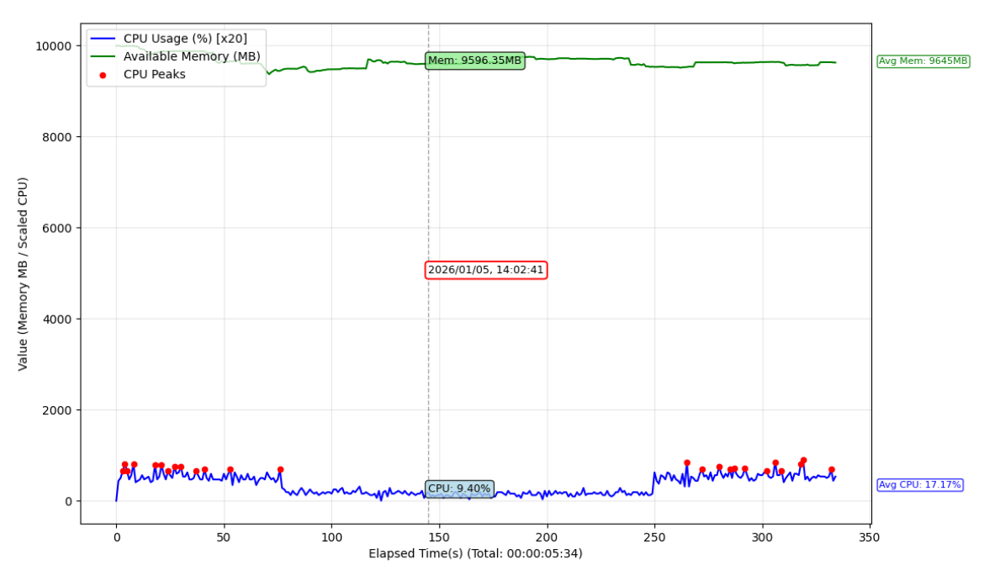

# jastm

Just Another Soak Testing Monitor — real-time system monitoring and post-run analysis for soak/stability testing.

## Overview

- **Data Collection Mode**: Samples CPU and memory at a configurable interval, optionally scoped to a process (by name, PID, or launched program). Writes a CSV log and supports an optional in-process GUI for live charts.
- **Analysis Mode**: Loads a collected CSV, computes statistics and peak detection, and optionally shows a summary report and/or an interactive metrics chart.

## Project structure

- `jastm.py`: Main CLI entrypoint and implementation of data collection and analysis.
- `README.md`: Usage guide and high-level documentation.
- `wiki/journal.md`: Developer journal recording technical decisions, implementation phases, and insights.
- `tests/`: Automated test suite ensuring correctness of all features.
  - `smoke_test.py`: Comprehensive test suite covering CLI parsing, validation, data collection, and post-run analysis.
  - `happy_path.py`: High-level tests verifying core end-to-end user workflows.

## Requirements

- **Python**: 3.x
- **Dependencies**: `psutil`, `matplotlib` (with TkAgg backend), `tkinter` (usually bundled with Python)

Install:

```bash
pip install psutil matplotlib
```

## Usage

### Data collection (soak run)

- **System-wide** (no process filter):  
  `python jastm.py`
- **By process name**:  
  `python jastm.py --process-name "python.exe"`
- **By PID**:  
  `python jastm.py --process-id 12345`
- **Launch and monitor a program**:  
  `python jastm.py --program myapp.exe [args...]`

Options:

| Option | Description | Default |
|--------|-------------|---------|
| `--sample-rate` | Sampling interval in seconds | `1.0` |
| `--machine-id` | 4-digit identifier for this machine; if omitted, a 4-digit ID is derived from the NIC MAC address | Derived from NIC MAC (4 digits) |
| `--config-file` | Path to INI config file providing default values for supported options | *(none)* |

Log file is created automatically, using the pattern: `{process_name|PID{id}|timestamp}_{YYYYMMDD_HHMMSS}_monitor.csv` (for example, `chrome_PID1234_20231025_100000_monitor.csv`). The log contains these columns: `Timestamp`, `CPU_Usage_%`, `Memory_MB`, `VMS_MB`, and `RSS_MB`. Data collection stops after 10 consecutive metric failures (such as process exit).

### Analysis (post-run)

- **Summary only**:  
  `python jastm.py --parse-file 20231025_100000_monitor.csv --summary`
- **Interactive chart**:  
  `python jastm.py --parse-file 20231025_100000_monitor.csv --metrices-window`
- **Both**: use `--summary` and `--metrices-window` together.

Analysis options:

| Option | Description | Default |
|--------|-------------|---------|
| `--cpu-peak-percentage` | CPU peak = value above average by this % (e.g. 90 → 1.9× avg) | `90.0` |
| `--ram-peak-percentage` | Memory “peak” = available MB below average by this % (0–100) | `50.0` |

`--parse-file` cannot be combined with `--process-name`, `--process-id`, or `--program`.

`--config-file` applies to both collection and analysis options; see **Config file (`config.ini`)**.

#### Aggregating multiple runs

When you have soak logs from multiple machines (or multiple runs) and want a **single, human-readable overview**, use `--aggregate-summaries` with one or more CSV files:

- **Aggregate across several CSV logs**:  
  `python jastm.py --aggregate-summaries machineA_20231025_100000_monitor.csv machineB_20231025_110000_monitor.csv`

- **With custom peak thresholds** (applied uniformly to all inputs):  
  `python jastm.py --aggregate-summaries *.csv --cpu-peak-percentage 80 --ram-peak-percentage 40`

This prints a markdown table, one row per input CSV, with the following columns:

- `Machine ID`
- `Start Time`
- `Duration`
- `CPU(%)`
- `CPU Peak` (count)
- `RAM(MB)` (average available)
- `RAM Peak` (count)
- `RAM Slope` (MB/hour)
- `RAM R-Square`
- `Flags` (e.g., `CPU_PEAKS`, `MEM_PEAKS`)

`machine_id` is inferred from a 4-digit token in the CSV filename when possible (for example, `node_1234_20231025_monitor.csv` → `1234`). If no such token is found, it falls back to the effective `--machine-id` value (from CLI, config, or the derived default).

### Config file (`config.ini`)

- **Purpose**: Centralize default values for most CLI options.
- **Enabling**: Pass `--config-file path/to/config.ini` to load an INI config. If a `config.ini` exists in the same directory as `jastm.py`, it is loaded automatically (no flag needed).
- **Precedence**:
  - Command-line arguments **override** values from `config.ini`.
  - `config.ini` values override built-in defaults.
- **Config-managed options**:
  - Collection: `sample_rate`, `machine_id`
  - Analysis: `cpu_peak_percentage`, `ram_peak_percentage`
- **CLI-only options (not stored in config)**:
  - `--parse-file`
  - `--summary`
  - `--metrices-window`
  - `--process-name`
  - `--process-id`
  - `--program`
- **Analysis mode behavior**:
  - When `--parse-file` is used, collection settings from `config.ini` are ignored.
  - Analysis thresholds from `config.ini` still apply unless overridden on the CLI.

Example `config.ini`:

```ini
[collection]
sample_rate = 1.0
# machine_id =

[analysis]
cpu_peak_percentage = 90.0
ram_peak_percentage = 50.0
```

Empty or commented-out values are treated as not set. Process targeting (`--process-name`, `--process-id`, `--program`) is CLI-only and cannot be set in the config file.

## Collected metrics

- **CPU**: Per-process CPU % (when a process is targeted) or system-wide CPU % (when no process is specified). First sample after start may be 0 (priming).
- **Memory (System)**: System-wide **available** memory in MB (`psutil.virtual_memory().available`).
- **Virtual Address Space (Process-specific)**:
  - **VMS**: Virtual Memory Size (total address space reserved).
  - **RSS**: Resident Set Size (actual physical RAM used).

## CSV format

- **Header**: `Timestamp`, `CPU_Usage_%`, `Memory_MB`, `VMS_MB`, `RSS_MB`
- **Timestamp**: ISO format `YYYY-MM-DD HH:MM:SS`
- **CPU_Usage_%**: Float (e.g. 6 decimals)
- **Memory_MB**: Float (2 decimals)
- **VMS_MB / RSS_MB**: Float (2 decimals, or `N/A` if no process specified)

## Analysis behavior

- **Duration**: From first to last timestamp in the CSV.
- **Stats**: Min / max / average for CPU (%) and memory (MB).
- **Peak detection**:
  - **CPU peak**: Sample where `CPU_Usage_% > cpu_peak_percentage`.
  - **Memory peak**: Sample where `Memory_MB < avg_memory * (1 - ram_peak_percentage/100)` (low available RAM).
- **Memory trend (R² & slope)**: Linear regression of `Memory_MB` over elapsed time is computed to show a **slope in MB/hour** and an **R-squared index** (`R^2`) indicating how well a linear trend explains memory behavior.
- **VAS Analysis & Fragmentation Risk**: 
  - Calculates the overall trend (slope) for **VMS**, **RSS**, and the **Fragmentation Gap** (VMS - RSS).
  - **Fragmentation Risk Alert**: Triggered if the `VMS / RSS` ratio exceeds 1.5x, or if VMS shows a steady upward slope while RSS remains relatively flat (indicating potential address space exhaustion).
- **Summary output example**: Display includes total duration, time period (start and end timestamps), minimum/maximum/average CPU and memory, a memory trend line, process VAS statistics (if applicable), and fragmentation risk alerts, followed by markdown tables listing CPU peaks and memory peaks.  
  ```
  Duration: 00:00:05 (5 seconds)
  Time Period: 2023-10-25 10:00:00 ~ 2023-10-25 10:00:05

  CPU Usage (%):
    Min: 5.5
    Max: 95.0
    Avg: 25.36

  System Memory Trend: slope=-34740.00 MB/hour | R^2=0.018 (decreasing)

  Process VAS Stats:
    VMS (Virtual Size): Min=100.00 MB | Max=200.00 MB
    RSS (Working Set):  Min=50.00 MB | Max=54.00 MB
    VMS Trend: slope=72000.00 MB/hour | R^2=0.850
    RSS Trend: slope=2880.00 MB/hour | R^2=0.980
    Fragmentation Gap Trend: slope=69120.00 MB/hour

    [!] FRAGMENTATION RISK DETECTED:
        - VMS is growing steadily while RSS is relatively flat.

  | CPU Peak Time        | CPU % | Memory MB |
  |---------------------|-------|-----------|
  | 2023-10-25 10:00:03 | 95.0  | 1800.00   |
  ```

  (Peak rows show only samples exceeding peak thresholds. Tables may be empty if no peaks detected.)
- **Metrics window**: Chart of elapsed time vs. scaled CPU (×20) and available memory (MB); scatter overlay for CPU (red) and memory (orange) peaks; zoom (scroll), hover (interpolated values), arrow-key cursor; average CPU and average memory labels on the right.


## Testing

JASTM includes an automated testing suite under the `tests/` directory to ensure all features work reliably without regressions.

To run the tests:

- **Happy Path Tests** (`tests/happy_path.py`): Verifies the core, end-to-end workflows (system-wide monitoring, process filtering, launching a program, generating summaries, aggregating multiple CSVs, and parsing config overrides). Run it via:
  ```bash
  python tests/happy_path.py
  ```
  *Tip: You can list all the testing items and their expected results by passing the `--list-items` flag:*
  ```bash
  python tests/happy_path.py --list-items
  ```

- **Smoke Tests** (`tests/smoke_test.py`): A comprehensive `unittest` suite that rigorously tests edge cases, parameter validation, process termination behaviors, and detailed output parsing. Run it via:
  ```bash
  python -m unittest tests.smoke_test -v
  ```
  *Tip: You can list all the testing items and their expected results by passing the `--list-items` flag:*
  ```bash
  python tests/smoke_test.py --list-items
  ```

Both test scripts automatically clean up any generated `*_monitor.csv` artifacts after execution to keep your directory tidy.